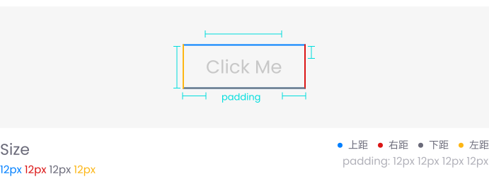

# 按钮 <Badge type="in"></Badge>
按钮组件(`<ql-button>`)是一个可以根据不同需求添加不同样式和功能的基础组件。

::: tip 👏 开始使用琼楼组件

这是您第一次阅读和查看琼楼组件,我们会根据本组件详细介绍其设计理念和使用方法,方便您更好地使用和开发。

琼楼组件采用“自然”的设计方式,让开发者无需花费过多时间就可以掌握使用,类似编写 CSS 一样通过键值设置实现。这与 [Tailwind CSS](https://tailwindcss.com/) 的设计理念类似，印证了我们设计理念的正确性。

:::

<demo src="./button.vue" desc="使用 `ql-button` 标签来创建一个按钮。你可以通过不同的属性来定制按钮的外观和行为。"></demo>


## 自定义示例


我们通常为每个组件提供 3 到 5 个预设样式,未来会由社区维护提供 7 到 8 个预设(并持续扩展)。如果社区提供的预设无法满足您的需求,您也可以直接传入键值对进行自定义（如上图自定义 size 那样）。

同时，社区提供了在线编辑器，方便开发者自定义组件并发布至社区。我们会根据组件的欢迎程度,将自定义预设融合到组件中,通过 `theme` 切换使用。


## 属性

以下是可用的属性列表：

| 参数     | 说明             | 类型    | 可选值                               | 默认值  |
| -------- | ---------------- | ------- | ------------------------------------ | ------- |
| type     | 按钮的类型       | String  | primary / success / warning / danger | primary |
| size     | 按钮的尺寸       | String  | small / medium / large               | small   |
| plain    | 是否为基础按钮   | Boolean |                                      | false   |
| round    | 是否为圆角按钮   | Boolean |                                      | false   |
| circle   | 是否为圆形按钮   | Boolean |                                      | false   |
| disabled | 是否禁用按钮     | Boolean |                                      | false   |
| link     | 是否为链接按钮   | Boolean |                                      | false   |
| loading  | 是否为加载中状态 | Boolean |                                      | false   |

## 插槽

默认插槽：按钮的内容可以通过默认插槽来自定义。

```vue
<template>
  <ql-button>
    <span>Custom Content</span>
  </ql-button>
</template>
```
